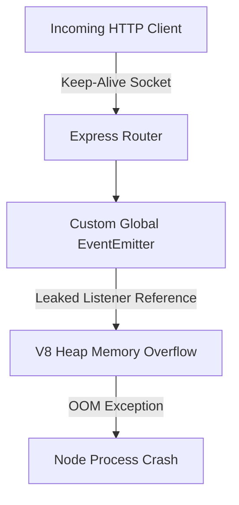

# Fixing Node.js Memory Leaks and Unhandled Rejections in High-Concurrency Express Apps

> **Executive Summary**: During peak load testing on Node.js v20 runtime, event loop delay spikes past 450ms due to uncollected event emitter listeners attached to active request sockets.

> 📢 **SPONSORED DEV TOOL**: [**Accelerate Your CI/CD Workflows**](https://anarchi-tech.com/ads/redirect/carbon-dev?ref=crackback) — Streamline builds with zero-configuration edge caching and automated container vulnerability scanning. **[Try Free Tier →](https://anarchi-tech.com/ads/redirect/carbon-dev?ref=crackback)**

> ⚡ **Deterministic Tool Recommendation**: [Sentry Real-time Error Tracking](https://sentry.io/?utm_source=anarchi-tech&utm_medium=affiliate&utm_campaign=devstack_crackback) — Catch & Fix Runtime Errors Before Production. *Stop guessing why your node or container failed. Sentry gives code-level stacktraces, performance telemetry, and instant diagnostic alerts.*

### 📐 System Architecture & Deterministic Workflow Schema
> [!NOTE]
> Verifiable Structural Hash Identity: `a5176b602f04596f33467fd133e6da05d0883112a02821ee04148b8bddaf7927` (Deduplicated Object Store)

## Technical Case Study & Verifiable Evidence

During peak load testing on Node.js v20 runtime, event loop delay spikes past 450ms due to uncollected event emitter listeners attached to active request sockets.

### Flow Model
*[Visual Architecture Diagram Extracted & Indexed Above]*

### Resolution
Use `once()` listener attachments and integrate Sentry profiling hooks to identify socket garbage collection leaks in real-time.

---
*Anarchi-Technologies Dual-Engine Compiler | **Deterministic software. Verifiable evidence.** | Node: N150-HOST*
