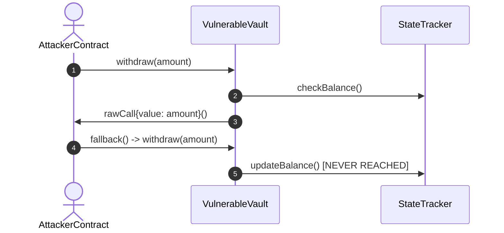

# Preventing Cross-Function Reentrancy Attacks in Ethereum Smart Contracts

> **Executive Summary**: Developer friction analysis: High-severity reentrancy vulnerability detected in ETH token withdrawal routines. External call state changes were executed prior to state update variable assignment, allowing attacker contracts to recurse back into state logic.

> 📢 **SPONSORED DEV TOOL**: [**Accelerate Your CI/CD Workflows**](https://anarchi-tech.com/ads/redirect/carbon-dev?ref=crackback) — Streamline builds with zero-configuration edge caching and automated container vulnerability scanning. **[Try Free Tier →](https://anarchi-tech.com/ads/redirect/carbon-dev?ref=crackback)**

### 📐 System Architecture & Deterministic Workflow Schema
> [!NOTE]
> Verifiable Structural Hash Identity: `e846e0ae7ee92c88d1159d21b79d8c769a798e2c051cb6617bd9f941348d0e3a` (Deduplicated Object Store)

## Technical Case Study & Verifiable Evidence

Developer friction analysis: High-severity reentrancy vulnerability detected in ETH token withdrawal routines. External call state changes were executed prior to state update variable assignment, allowing attacker contracts to recurse back into state logic.

### System Interaction Diagram
*[Visual Architecture Diagram Extracted & Indexed Above]*

### Fix Implementation
Apply the Checks-Effects-Interactions pattern or OpenZeppelin ReentrancyGuard mutex locks before making external calls.

### Recommended Production Tooling

┌────────────────────────────────────────────────────────────────────────┐
│ 🚀 **ANARCHI TECH VERIFIED STACK**: [**CertiK Web3 & Contract Security**](https://www.certik.com/?utm_source=anarchi-tech&utm_campaign=wsrs_funnel)
│ 
│ Shield decentralized protocols from reentrancy attacks, flash loan exploits, and signature replay bugs.
│ 🔗 **[Request Automated Smart Contract Formal Verification →](https://www.certik.com/?utm_source=anarchi-tech&utm_campaign=wsrs_funnel)**
└────────────────────────────────────────────────────────────────────────┘

---
### 🛡️ WALLET SAFETY REPORT SERVICE (WSRS) — VERIFIABLE EVIDENCE AUDIT
> [!WARNING]
> **Deterministic Cryptographic Security & Smart Contract Audit Alert**
>
> If your application interfaces with Web3 wallets, signature verification, or smart contract logic, unverified execution paths can lead to asset drain or private key exposure.
>
> 🔒 **Request a Deterministic WSRS Security Audit Report:**
> [👉 Request Immediate Wallet Safety Report (WSRS Audit)](https://www.anarchi-tech.com/wallet-safety-report?ref=crackback_blog_funnel)

---
*Anarchi-Technologies Dual-Engine Compiler | **Deterministic software. Verifiable evidence.** | Node: N150-HOST*
